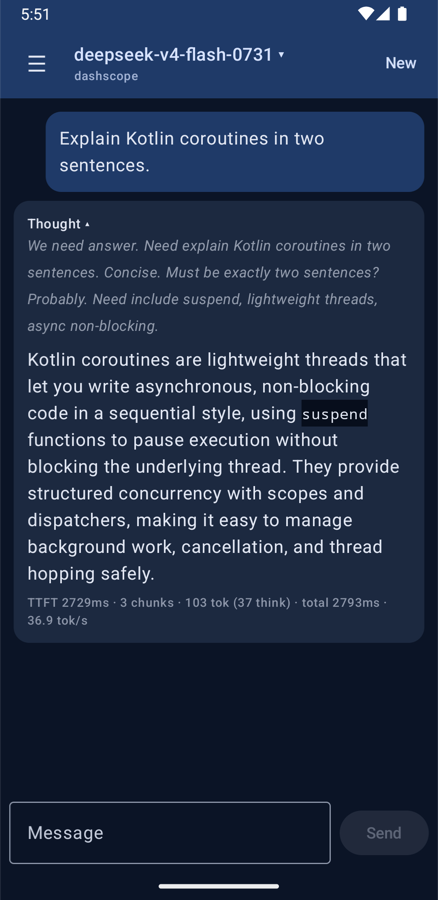

# BifrostChat

[](https://github.com/maturapoj/BifrostChat/actions/workflows/ci.yml)
[](https://kotlinlang.org)
[](https://developer.android.com/compose)
[](https://m3.material.io)
[](https://developer.android.com/about/versions/oreo)
[](https://developer.android.com/about/versions/16)
[](https://kotlinlang.org/docs/flow.html)
[](https://square.github.io/okhttp/)
[](https://developer.mozilla.org/docs/Web/API/Server-sent_events)
[](https://platform.openai.com/docs/api-reference/chat/streaming)
[](LICENSE)

A Jetpack Compose chat client for experimenting with **LLM token streaming** on Android.
It talks to any OpenAI-compatible gateway (`/v1/chat/completions` with `stream: true`)
and renders the reply as it arrives: reasoning tokens and answer tokens appear separately.



## Features

- Streams tokens over server-sent events. **Stop** cancels the stream and closes the HTTP connection.
- Shows reasoning tokens (`delta.reasoning` / `delta.reasoning_content`) in a collapsible "Thinking…" block.
- Batches UI updates (at most one every 50 ms) instead of recomposing once per chunk.
- Shows stats under each reply: time to first token, number of UI updates, completion and reasoning tokens, total time, tok/s.
- Loads the model picker from `/v1/models`.

## How the stream flows

```text
OkHttp response body
  └─ readUtf8Line()              one SSE line at a time, as soon as it arrives
      └─ SseChunkParser          "data: {...}" → Reasoning / Content / Usage / Finished
          └─ Flow<StreamEvent>   BifrostClient.streamChat(), runs on Dispatchers.IO
              └─ coalesceTokens()  batches deltas on a 50 ms timer
                  └─ ChatViewModel  appends deltas to the last message in a StateFlow
                      └─ ChatScreen  LazyColumn(reverseLayout = true) keeps the newest text in view
```

| File | Role |
| --- | --- |
| [`data/BifrostClient.kt`](app/src/main/java/com/example/bifrostchat/data/BifrostClient.kt) | HTTP calls; turns the SSE body into a cancellable `Flow` |
| [`data/SseChunkParser.kt`](app/src/main/java/com/example/bifrostchat/data/SseChunkParser.kt) | Parses one SSE line; `[DONE]` ends the stream, `error` payloads throw |
| [`data/CoalesceTokens.kt`](app/src/main/java/com/example/bifrostchat/data/CoalesceTokens.kt) | Timer-based batching of token deltas |
| [`ui/ChatViewModel.kt`](app/src/main/java/com/example/bifrostchat/ui/ChatViewModel.kt) | Chat state, send/stop, stream stats |
| [`ui/ChatScreen.kt`](app/src/main/java/com/example/bifrostchat/ui/ChatScreen.kt) | Compose UI |

## Notes from testing

**The gateway delivers chunks in bursts.** Chunk arrival times measured with curl looked like this:
the first ~20 chunks arrived together at 2.5 s, then more came in groups about a second apart.
This affected two design choices:

- **Throttling has to flush on a timer.** A throttle that only emits when the next token arrives
  holds the tail of each burst until the next burst, about a second later.
  `coalesceTokens()` starts a timer at the first buffered token and flushes when it fires.
  `Usage` and `Finished` flush the buffer first, then pass through.
- **tok/s is measured over the whole request.** Measuring from first to last token gave
  values like 2,000+ tok/s, because a whole burst lands in a few milliseconds.

**Auto-scroll uses `reverseLayout`.** Scrolling to the last item after each update missed
the bottom when the message grew or the keyboard opened. A reversed list keeps index 0
(the newest message) anchored to the bottom.

## Setup

Requirements: Android SDK (compileSdk 36), JDK 17+.

```sh
cp local.properties.example local.properties
```

Fill in `local.properties`:

```properties
sdk.dir=/path/to/Android/sdk
bifrost.baseUrl=https://your-gateway.example.com   # without /v1
bifrost.apiKey=sk-...
```

Then:

```sh
./gradlew installDebug        # build and install on a device or emulator
./gradlew testDebugUnitTest   # parser and coalescing tests (virtual time, no network)
```

> [!WARNING]
> The API key is compiled into `BuildConfig`, so anyone who has the APK can extract it.
> This is fine for local experiments. Do not distribute builds made with a real key;
> a production app should call its own backend instead.

## Stack

Kotlin 2.2 · Jetpack Compose (BOM 2026.02) · Material 3 · Coroutines/Flow · OkHttp 4.12 · `org.json`

## License

[MIT](LICENSE)
