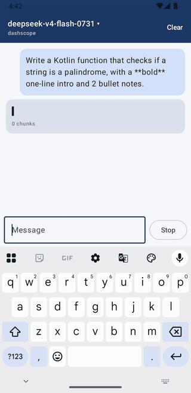
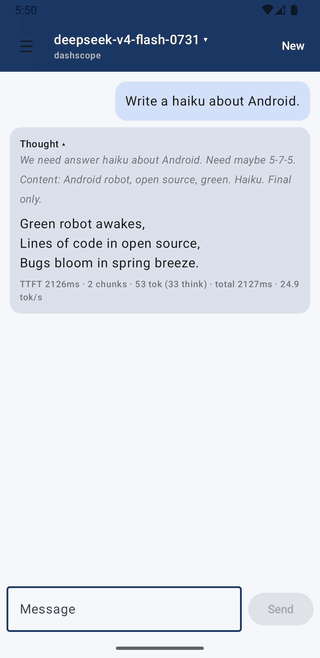
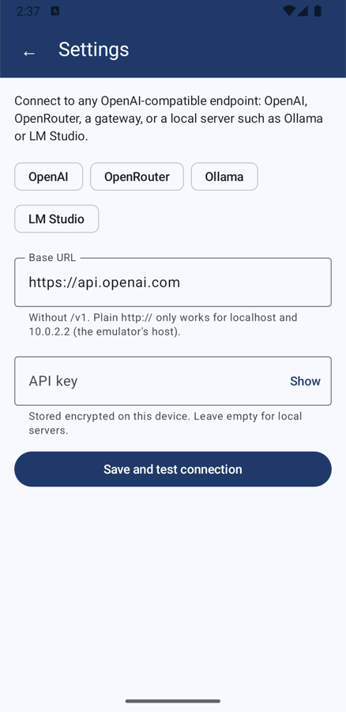

# TokenFlow

[](https://github.com/maturapoj/TokenFlow/actions/workflows/ci.yml)
[](https://github.com/maturapoj/TokenFlow/releases/latest)
[](https://kotlinlang.org)
[](https://developer.android.com/compose)
[](https://m3.material.io)
[](https://developer.android.com/about/versions/oreo)
[](https://developer.android.com/about/versions/16)
[](#clean-architecture)
[](https://insert-koin.io)
[](https://developer.android.com/training/data-storage/room)
[](https://kotlinlang.org/docs/flow.html)
[](https://square.github.io/okhttp/)
[](https://developer.mozilla.org/docs/Web/API/Server-sent_events)
[](https://platform.openai.com/docs/api-reference/chat/streaming)
[](LICENSE)

An Android chat client and reference project for **LLM token streaming** with Jetpack Compose.
It works with any OpenAI-compatible API (OpenAI, OpenRouter, an AI gateway, or a local
Ollama / LM Studio server) and renders the reply as it arrives, with reasoning and answer
tokens shown separately.

| Streaming | Chat history | Settings | Dark theme |
| :---: | :---: | :---: | :---: |
|  |  |  |  |

## Try it

1. Download the APK from [Releases](https://github.com/maturapoj/TokenFlow/releases/latest) (or build it, see [Development](#development)).
2. Open **Settings** and pick a preset or enter a base URL, add your API key, and tap **Save and test connection**.
3. Pick a model from the top bar and start chatting.

| Endpoint | Base URL | Key |
| --- | --- | --- |
| OpenAI | `https://api.openai.com` | required |
| OpenRouter | `https://openrouter.ai/api` | required |
| Ollama on your computer (emulator) | `http://10.0.2.2:11434` | leave empty |
| LM Studio on your computer (emulator) | `http://10.0.2.2:1234` | leave empty |
| Any other OpenAI-compatible server | its URL, without `/v1` | as needed |

The key is stored on the device, encrypted with a key from the Android Keystore.

## Features

- Streams tokens over server-sent events. **Stop** cancels the stream and closes the HTTP connection.
- Shows reasoning tokens (`delta.reasoning` / `delta.reasoning_content`) in a collapsible "Thinking…" block.
- Reveals text at a steady, backlog-adaptive pace, so bursty delivery reads as smooth typing.
- Renders Markdown in replies: headings, lists, quotes, **bold**, *italic*, `inline code`, links,
  and fenced code blocks with a language label, horizontal scrolling and a Copy button.
  Partial syntax mid-stream is handled: an unclosed fence renders as an open code block.
- Shows stats under each reply: time to first token, chunks received, completion and reasoning tokens, total time, tok/s.
- Saves chats on the device (Room). The ☰ drawer lists them newest first, titled after the first
  message; tap to reopen, ✕ to delete (with confirmation), **New** to start another. Each chat
  remembers its model, and the latest one reopens on launch.
- Saves replies **while they stream** (at most once a second), so Stop, switching chats, or the
  process being killed keeps the text received so far.
- Explains failures by kind (no connection, rejected key, rate limited, server or model error)
  in English or Thai, instead of raw HTTP text.
- Sends at most the 40 most recent messages as context.
- Loads the model picker from `/v1/models`, grouped by provider when ids look like `provider/model`.
  Embedding, speech, image and moderation models are hidden. The last picked model is remembered.
- Endpoint and API key are set in the app (Settings), not at build time; changing them reloads models without a restart.

## How the stream flows

```text
OkHttp response body
  └─ readUtf8Line()              one SSE line at a time, as soon as it arrives
      └─ SseChunkParser          "data: {...}" → Reasoning / Content / Usage / Finished
          └─ Flow<StreamEvent>   GatewayApi → ChatRepository (maps failures to ChatError), on an injected IO dispatcher
              └─ ChatUseCase.send()  folds events into the reply (Reply.kt), times it, saves it ≤1×/s and at the end
                  └─ ChatViewModel    mirrors each reply snapshot as ChatResult.ReplyUpdated
                      └─ reduce()      pure (ChatState, ChatResult) → ChatState
                          └─ ChatContent  LazyColumn(reverseLayout = true) keeps the newest text in view
                              └─ rememberSmoothReveal()  reveals the text at a steady pace
                                  └─ MarkdownText        one Text per block; finished blocks skip recomposition
```

### MVI

```text
 ChatContent ──ChatIntent──▶ ChatViewModel.onIntent()
      ▲                           │  side effects: use cases, stream job, chat switching
      │                           ▼
  ChatState ◀──reduce()──── ChatResult
      ChatEffect (one-off, e.g. "models failed" → Snackbar with Retry)
```

- **Intent:** `LoadModels`, `SelectModel`, `Send`, `Stop`, `NewChat`, `OpenSession`, `DeleteSession`. `onIntent()` is the only public entry point.
- **Result → reducer:** the ViewModel turns what the use cases report into a `ChatResult` and calls
  `reduce()`, a pure function tested without coroutines. The reply itself is built in the domain
  (`SessionMessage.apply(event, elapsed)`), so the reducer only swaps in the latest snapshot.
- **State:** a single immutable `ChatState` exposed as a `StateFlow`.
- **Effect:** one-off events go through a `Channel`, so they are not replayed on recomposition or rotation.
- `ChatContent(state, onIntent)` is stateless, so it can be previewed and tested without a ViewModel.

### Clean Architecture

```text
presentation ──▶ domain ◀── data
      ▲                       ▲
      └────────── di ─────────┘   (Koin wires the layers together)
```

The domain layer is plain Kotlin: no Android, OkHttp or serialization imports.
The data layer implements the domain's repositories. Use cases hold the rules,
one class per area (`ChatUseCase`, `SessionUseCase`); pure pass-throughs such as
observing, creating or deleting sessions call the repository interface directly.

What "send a message" means lives in `ChatUseCase.send()`, not in the ViewModel: create the
session on the first message, save the user turn, cap the context, fold stream events into the
reply, time it, save it while it streams and once more at the end, and turn failures into a
`ChatError` on the reply. Failures cross layers as `ChatError`, never as transport exceptions;
the UI maps each kind to a translated message.

| Layer | File | Role |
| --- | --- | --- |
| domain | [`model/`](app/src/main/java/io/github/maturapoj/tokenflow/domain/model) | `ChatMessage`, `Role`, `StreamEvent`, `LlmModel`, `ModelGroup`, `ChatError`, `GatewaySettings`; `Reply.kt` folds events into a reply |
| domain | [`repository/ChatRepository.kt`](app/src/main/java/io/github/maturapoj/tokenflow/domain/repository/ChatRepository.kt) | Interface the data layer implements |
| domain | [`usecase/ChatUseCase.kt`](app/src/main/java/io/github/maturapoj/tokenflow/domain/usecase/ChatUseCase.kt) | `modelGroups()` (hides non-chat models, groups by provider) and `send()` (the whole send-and-save flow) |
| domain | [`usecase/SessionUseCase.kt`](app/src/main/java/io/github/maturapoj/tokenflow/domain/usecase/SessionUseCase.kt) | `load()` (session + messages) and `saveMessage()` (titles a chat from its first message) |
| data | [`remote/GatewayApi.kt`](app/src/main/java/io/github/maturapoj/tokenflow/data/remote/GatewayApi.kt) | OkHttp calls to the configured endpoint; turns the SSE body into a cancellable `Flow` |
| data | [`settings/`](app/src/main/java/io/github/maturapoj/tokenflow/data/settings) | Settings in DataStore; the API key encrypted with AES-GCM via the Android Keystore |
| data | [`remote/SseChunkParser.kt`](app/src/main/java/io/github/maturapoj/tokenflow/data/remote/SseChunkParser.kt) | Parses one SSE line into `SseLine` (`Ignored`, `Done`, `Chunk`); `error` payloads throw |
| data | [`remote/ErrorMapping.kt`](app/src/main/java/io/github/maturapoj/tokenflow/data/remote/ErrorMapping.kt) | HTTP status, stream errors, I/O and parse failures → `ChatError` |
| data | [`local/ChatDatabase.kt`](app/src/main/java/io/github/maturapoj/tokenflow/data/local/ChatDatabase.kt) | Room entities (`sessions`, `messages`) and DAO; schema v2 (auto-migrated from v1) exported to `app/schemas/` |
| data | [`repository/SessionRepositoryImpl.kt`](app/src/main/java/io/github/maturapoj/tokenflow/data/repository/SessionRepositoryImpl.kt) | Maps Room entities to domain sessions and messages |
| data | [`repository/ChatRepositoryImpl.kt`](app/src/main/java/io/github/maturapoj/tokenflow/data/repository/ChatRepositoryImpl.kt) | Maps DTOs and gateway ids (`provider/name`) to domain models |
| presentation | [`chat/ChatScreen.kt`](app/src/main/java/io/github/maturapoj/tokenflow/presentation/chat/ChatScreen.kt) | `ChatScreen` (collects state and effects), stateless `ChatContent` with the drawer and top bar |
| presentation | [`chat/ChatViewModel.kt`](app/src/main/java/io/github/maturapoj/tokenflow/presentation/chat/ChatViewModel.kt) | Handles intents, calls use cases, dispatches results |
| presentation | [`chat/state/`](app/src/main/java/io/github/maturapoj/tokenflow/presentation/chat/state) | MVI contract (`ChatState`, `ChatIntent`, `ChatEffect`, `ChatResult`) and the pure reducer |
| presentation | [`chat/components/`](app/src/main/java/io/github/maturapoj/tokenflow/presentation/chat/components) | `SessionDrawer`, `ModelPicker`, `MessageBubble` (reasoning, stats), `InputBar`, `ErrorText` |
| presentation | [`chat/streaming/`](app/src/main/java/io/github/maturapoj/tokenflow/presentation/chat/streaming) | `rememberSmoothReveal()` pacing |
| presentation | [`chat/markdown/`](app/src/main/java/io/github/maturapoj/tokenflow/presentation/chat/markdown) | Streaming-tolerant Markdown parser (blocks and inline) and `MarkdownText` renderer |
| presentation | [`settings/`](app/src/main/java/io/github/maturapoj/tokenflow/presentation/settings) | Settings screen: presets, endpoint and key, save-and-test |
| presentation | [`theme/Theme.kt`](app/src/main/java/io/github/maturapoj/tokenflow/presentation/theme/Theme.kt) | Navy light and dark color schemes |
| di | [`di/Modules.kt`](app/src/main/java/io/github/maturapoj/tokenflow/di/Modules.kt) | Koin `dataModule` (OkHttp, API, Room), `domainModule`, `presentationModule` |

## Notes from testing

**Some gateways deliver chunks in bursts.** Against a Bifrost gateway in front of DashScope, chunk arrival times measured with curl looked like this:
the first ~20 chunks arrived together at 2.5 s, then more came in groups about a second apart.
This affected two design choices:

- **Timers start on the first change, not on each one.** A throttle that only acts when the next
  token arrives holds the tail of each burst until the next burst, about a second later; a
  debounce never fires while tokens keep coming. Saving the reply uses a timer that starts at the
  first unsaved change and writes the latest reply when it fires (at most once a second), and no
  timer runs while nothing has changed.
- **tok/s is measured over the whole request.** Measuring from first to last token gave
  values like 2,000+ tok/s, because a whole burst lands in a few milliseconds.

**Smooth reveal hides the bursts.** The client can't make tokens arrive sooner, but it can
spread each burst over time. `rememberSmoothReveal()` reveals at `max(80 chars/s, backlog / 0.5 s)`:
big bursts drain quickly, short tails don't crawl. The frame loop only runs while there is
a backlog, and text already present (after rotation or scrolling back) shows at once.

**No UI throttle is needed.** An earlier version batched token deltas on a 50 ms timer before the
UI. Now the domain folds events into full reply snapshots; `StateFlow` keeps only the latest and
Compose recomposes at most once per frame, so a separate throttle added nothing. Removing it also
made time-to-first-token exact and stopped Stop from dropping the last ≤50 ms of text.

**Markdown is rendered per block.** Each paragraph, list item or code block is its own `Text`,
so while a reply streams only the last block re-lays out; finished blocks are skipped.

**Replies are saved while they stream.** The reply row is inserted when streaming starts and
updated at most once a second, so killing the process loses at most that much text (tested with
`am force-stop` mid-reply). The final write runs in `NonCancellable`, so Stop or switching chats
(which waits with `cancelAndJoin`) keeps the partial answer; a reply that got nothing is removed.
A new chat isn't stored until its first message, so empty chats don't pile up.

**Auto-scroll uses `reverseLayout`.** Scrolling to the last item after each update missed
the bottom when the message grew or the keyboard opened. A reversed list keeps index 0
(the newest message) anchored to the bottom.

## Development

Requirements: Android SDK (compileSdk 36), JDK 17+.

```sh
cp local.properties.example local.properties   # set sdk.dir
./gradlew installDebug                          # build and install on a device or emulator
./gradlew testDebugUnitTest                     # unit tests: parsers, use cases, reducer, ViewModels, Koin graph
./gradlew connectedDebugAndroidTest             # device tests: Room + migration, Keystore encryption, Compose UI
```

To skip typing an endpoint while developing, debug builds can preload one from `local.properties`
(`tokenflow.baseUrl`, `tokenflow.apiKey`). Release builds never embed an endpoint or key.

CI runs unit tests, device tests on an emulator and a gitleaks scan on every push. Pushing a
`v*` tag builds a signed APK and attaches it to a GitHub Release. See [CONTRIBUTING.md](CONTRIBUTING.md).

## Stack

Kotlin 2.2 · Jetpack Compose (BOM 2026.02) · Material 3 · MVI · Clean Architecture · Koin 4.1 · Room 2.8 · DataStore · Coroutines/Flow · OkHttp 4.12 · kotlinx.serialization

## License

[MIT](LICENSE)
